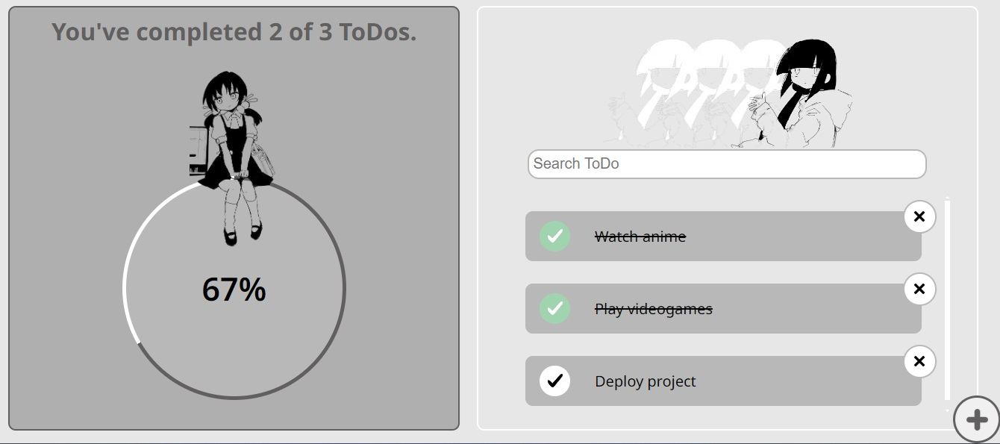
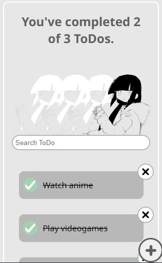
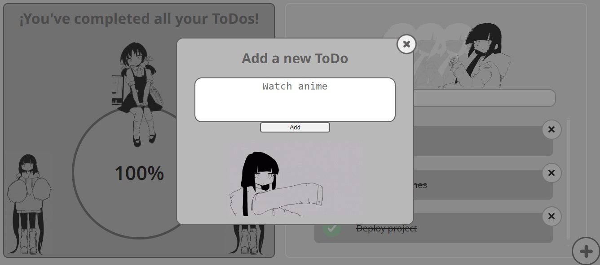

# TODO-React
This repository contains the code of a small project named "ToDo Machine", which consists of creating notes with the things **To Do** of the user.
This application lets the user create, delete, and mark as completed the ToDos, while also letting to search any ToDo by name. Last but not least, this project has **persistence of the information**, meaning that the ToDos of the user are gonna be there whether they refresh the page or turn off their computer/cellphone.
This application uses React, HTML, CSS, and some npm packages such as GitHub Pages for the [deploy](https://osumep.github.io/TODO-React/).
This is my first project ever created with React, hope you like it.
# Screenshots

